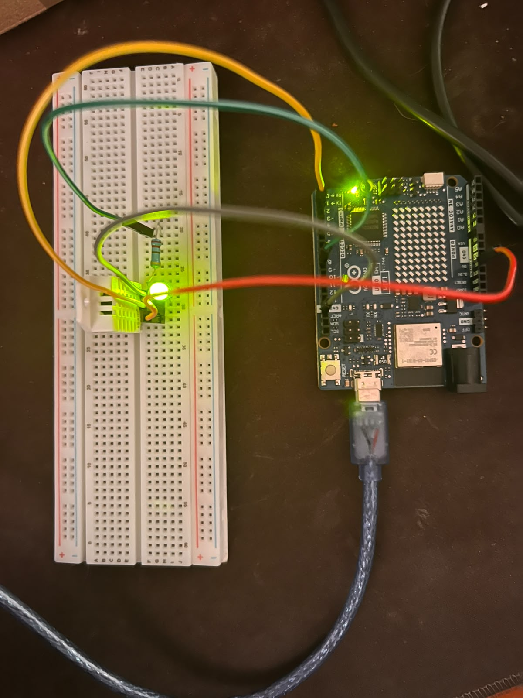

# Nombre del proyecto
Arduino leer DTH22

## Descripción
Con el uso de un modulo DHT22, detectamos si la temperatura sobrepasa ciertos grados, en caso de sobrepasarlos, el arduino manda la información a make mediante un módulo de webhook, un módulo de bot de telegram envía un mensaje al usuario informandole de la temperatura.

## Objetivos de aprendizaje
Aprender a hacer correcto uso de arduino, leds, resistencia y módulo DHT22

## Material utilizado
Protoboard
Arduino UNO R4 WIFI
4 Jumpers
Resistencia
LED

## Diagrama del circuito

## Código

## Video del funcionamiento

## Evidencias de armado

## Reporte

## Gráficas

## Tablas de datos

## Observaciones sobre el comportamiento del sistema

## Conclusiones

## Resultados
